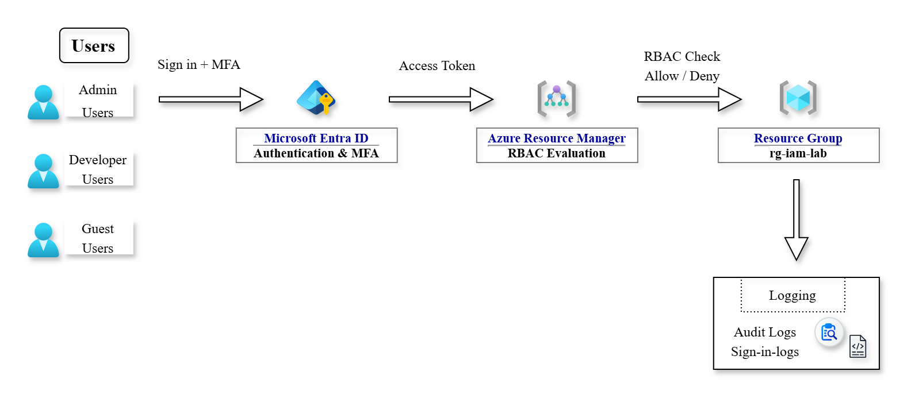

# Architecture

This folder contains the architecture diagram for the Azure IAM & RBAC lab project.

The diagram illustrates:
- Microsoft Entra ID (Azure AD) as the identity provider
- Authentication with MFA (Security Defaults)
- Authorization using Azure RBAC
- Role assignment at Resource Group scope
- Access enforcement by Azure Resource Manager (ARM)

 
